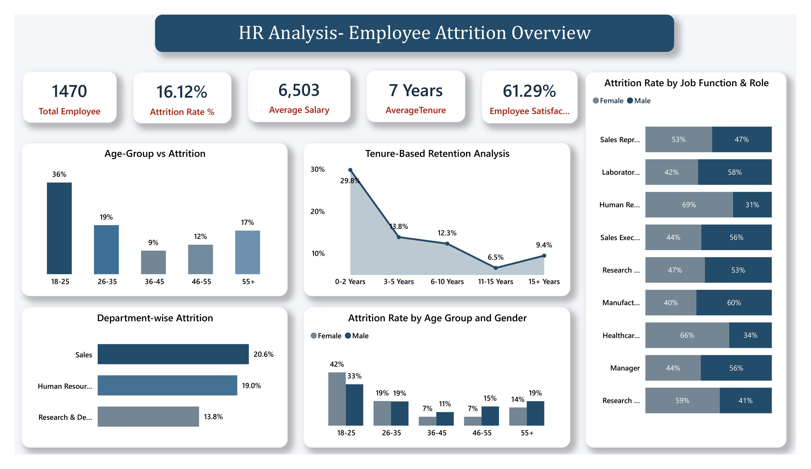
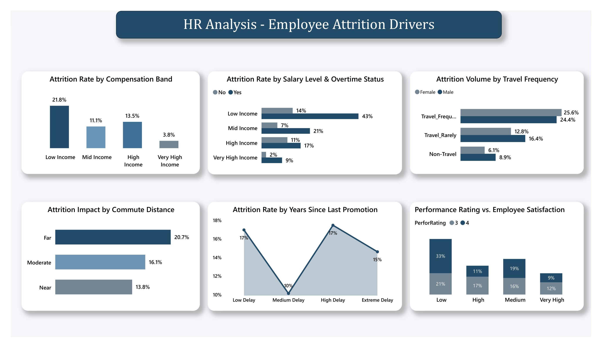
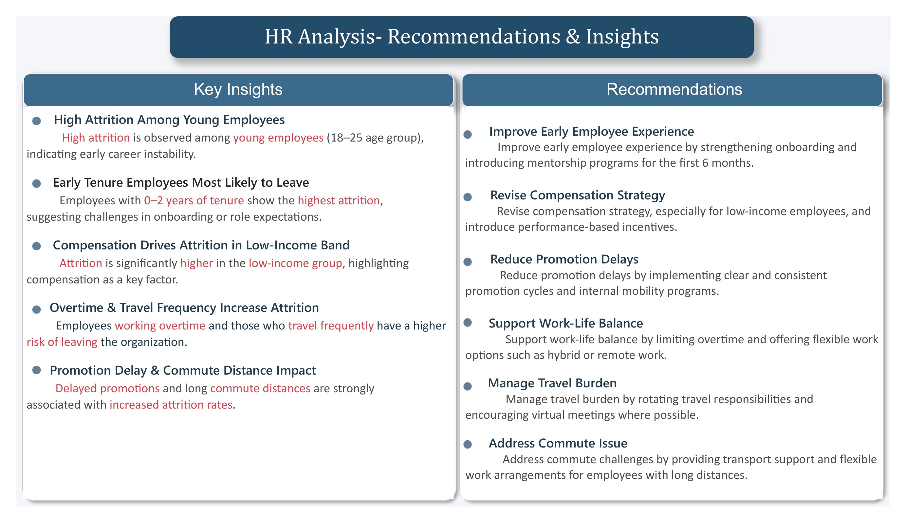

# HR Analytics: Employee Attrition Analysis

“A Power BI dashboard built to analyze employee attrition, identify key factors behind employee turnover, and help HR make better retention decisions.”

---

## Table of Contents
* [Overview](#overview)
* [Business Problem](#business-problem)
* [Dataset](#dataset)
* [Tools & Technologies](#tools--technologies)
* [Key Insights](#key-insights)
* [Dashboard](#dashboard)
* [Result & Conclusions](#result--conclusions)
* [Future Work](#future-work)
* [Author & contacts](#author--contacts)

---

## Overview
“Employee turnover can reduce productivity and increase hiring costs. This project analyzes factors such as salary, job tenure, demographics, and work environment to understand why employees leave and how the company can improve retention.”

---

## Business Problem
The organization has an overall attrition rate of 16.12% among 1,470 employees. The goal of this project is to understand why employees are leaving by analyzing factors such as age, tenure, income, overtime, business travel, and commute distance. The analysis aims to identify high-risk employee groups and provide insights that can help the organization improve employee retention.

---

## Dataset
* **Source Dataset**: CSV file located in the [`data/`](data/) folder (`employee_attrition.csv`).
* **Key Fields**: `Age`, `Attrition`, `Department`, `JobRole`, `JobSatisfaction`, `MonthlyIncome`, `OverTime`, `PerformanceRating`, `TotalWorkingYears`, `YearsAtCompany`, `YearsSinceLastPromotion`, `DistanceFromHome`.

---

## Tools & Technologies
* **SQL**: Data querying, aggregation, and transformation.
* **Power BI**: Interactive dashboard creation and visualization.
* **GitHub**: Version control and documentation.

---

## Key Insights

* **High Attrition Among Young Employees:** Highest attrition occurs in the 18–25 age bracket (36%), signaling early-career instability or misalignment with initial expectations.

* **Early Tenure Vulnerability:** Employees with 0–2 years of tenure exhibit the highest attrition rate (29.8%), pointing to potential onboarding challenges.

* **Compensation Impact:** Attrition is disproportionately higher in the low-income band (21.8%) compared to higher income levels.

* **Overtime & Travel Friction:** Overtime work significantly multiplies attrition risk (up to 43% in low-income brackets), and frequent travel increases exit likelihood (~25%).

* **Commute & Promotion Delays:** Long commutes (Far: 20.7%) and delayed promotions directly correlate with higher attrition rates.

---

## Dashboard

### 1. HR Analysis - Employee Attrition Overview

*(Includes KPI cards for Total Employee, Attrition Rate %, Average Salary, Average Tenure, Employee Satisfaction %, Age-Group vs Attrition, Tenure-Based Retention Analysis, Department-wise Attrition, Attrition Rate by Age Group and Gender, and Attrition Rate by Job Function & Role)*

### 2. HR Analysis - Employee Attrition Drivers

*(Includes Attrition Rate by Compensation Band, Attrition Rate by Salary Level & Overtime Status, Attrition Volume by Travel Frequency, Attrition Impact by Commute Distance, Attrition Rate by Years Since Last Promotion, and Performance Rating vs. Employee Satisfaction)*

### 3. HR Analysis - Recommendations & Insights

*(Includes Key Insights on High Attrition, Early Tenure, Compensation Impact, Overtime & Travel, Promotion & Commute, paired with actionable Strategic HR Recommendations)*

---

## Result & conclusions

The analysis shows that employees in their early years of employment, lower-income roles, and those working overtime have a higher risk of attrition. Focusing on these areas can help the organization identify at-risk employees earlier, improve working conditions, and develop more effective employee retention strategies.

---

## Future Work

* Build a machine learning model to identify employees who may be at higher risk of leaving.

* Analyze employee feedback and exit interviews to better understand the reasons behind attrition.

* Track attrition trends over time to see whether retention strategies are actually helping reduce   employee turnover.

---

## Author & Contacts 

**Sakshi Verma**  
*Aspiring Data Analyst*

- **GitHub:** [@Sakshiverma555](https://github.com/Sakshiverma555)
- **Email:** sakshiverma@gmail.com